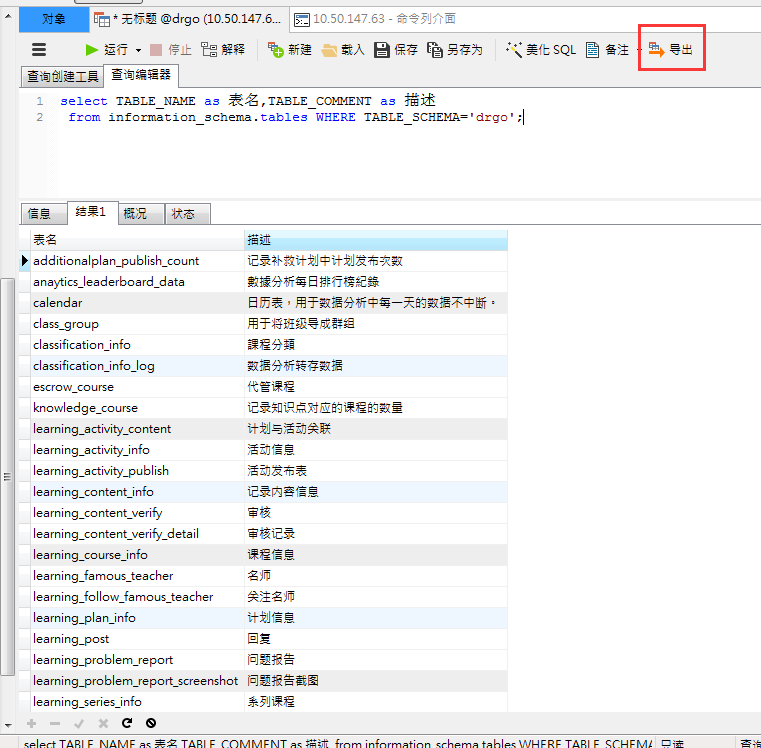
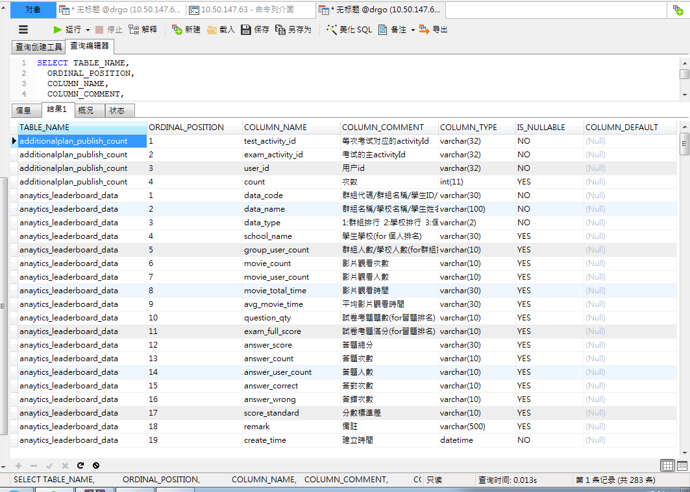
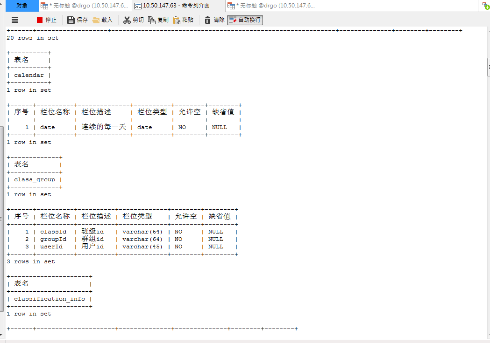
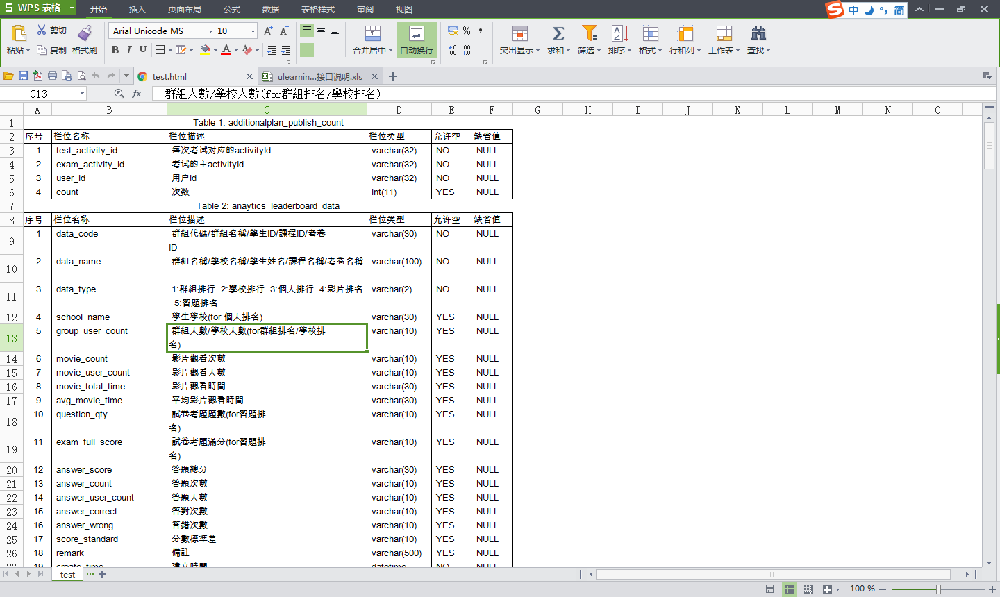

虽然navicat、sql yog等工具都支持将表结构打印出来，但是没办法自定义、而且不能直接在word、excel中使用。但是通过使用sql、存储过程、emacs可以满足这个需求，而且非常灵活。

# 打印所有的表名和描述

直接用sql组织想要的格式，

    select TABLE_NAME as 表名,TABLE_COMMENT as 描述
     from information_schema.tables WHERE TABLE_SCHEMA='drgo';

效果如图,直接在navicat上导出成想要的文档格式即可

# 打印所有表的字段以及字段的基本属性

这种要复杂一些，最先想到的还是用sql来组织格式。

    SELECT TABLE_NAME,
      ORDINAL_POSITION,
      COLUMN_NAME,
      COLUMN_COMMENT,
      COLUMN_TYPE,
      IS_NULLABLE,
      COLUMN_DEFAULT
    FROM
      `information_schema`.`columns`
    WHERE
      TABLE_SCHEMA = 'drgo'
    AND TABLE_NAME IN (
      SELECT
        TABLE_NAME
      FROM
        information_schema. TABLES
      WHERE
        TABLE_SCHEMA = 'drgo'
    );

这样导出到文档中显示效果不好，表与表中没有间隔，而且表名这一列很冗余。于是写了一个存储过程

    BEGIN
     DECLARE t_name VARCHAR (60);
     DECLARE done INT DEFAULT 0;
     #声明游标cursor_name
      DECLARE cursor_name CURSOR FOR
     SELECT
       TABLE_NAME
     FROM
       information_schema.tables
     WHERE TABLE_SCHEMA = 'drgo'
       AND TABLE_NAME NOT LIKE 't_%';
     #设置一个终止标记   
      DECLARE CONTINUE HANDLER FOR SQLSTATE '02000' SET done = 1;
     #打开游标  
      OPEN cursor_name;
     #获取游标当前指针的记录，读取一行数据并传给变量a,b  
      FETCH cursor_name INTO t_name;
     #开始循环，判断是否游标已经到达了最后作为循环条件   
      REPEAT
       SELECT
         t_name AS 表名;
       -- SELECT ORDINAL_POSITION,COLUMN_NAME,COLUMN_COMMENT,COLUMN_TYPE,IS_NULLABLE,COLUMN_DEFAULT  
        SELECT
         -- TABLE_NAME as 表名,
          ORDINAL_POSITION AS 序号,
         COLUMN_NAME AS 栏位名称,
         COLUMN_COMMENT AS 栏位描述,
         COLUMN_TYPE AS 栏位类型,
         IS_NULLABLE AS 允许空,
         COLUMN_DEFAULT AS 缺省值
       FROM
         `information_schema`.`columns`
       WHERE TABLE_NAME = t_name
         AND TABLE_SCHEMA = 'drgo';
       FETCH cursor_name INTO t_name;
       UNTIL done = 1
     END REPEAT;
     #关闭游标  
      CLOSE cursor_name;
     #语句执行结束  
    END $$

效果不错，结构清晰，层次分明。但是怎么把文本格式用到excel和world上呢？接下来该emacs出场了。主要用到了emacs的org mode和multiple-cursors。直接看效果

编辑之后得到的org文件是这样的。

    #  #+OPTIONS: ^:nil _ 用来禁用_转义，#+CAPTION: 用来设置表头
    #+OPTIONS: ^:nil _
    
    #+CAPTION: additionalplan_publish_count 
    | 序号 | 栏位名称         | 栏位描述                 | 栏位类型    | 允许空 | 缺省值 |
    +------+------------------+--------------------------+-------------+--------+--------+
    |    1 | test_activity_id | 每次考试对应的activityId | varchar(32) | NO     | NULL   |
    |    2 | exam_activity_id | 考试的主activityId       | varchar(32) | NO     | NULL   |
    |    3 | user_id          | 用户id                   | varchar(32) | NO     | NULL   |
    |    4 | count            | 次数                     | int(11)     | YES    | NULL   |
    +------+------------------+--------------------------+-------------+--------+--------+
    
    #+CAPTION: anaytics_leaderboard_data 
    | 序号 | 栏位名称          | 栏位描述                                                   | 栏位类型     | 允许空 | 缺省值 |
    +------+-------------------+------------------------------------------------------------+--------------+--------+--------+
    |    1 | data_code         | 群組代碼/群組名稱/學生ID/課程ID/考卷ID                     | varchar(30)  | NO     | NULL   |
    |    2 | data_name         | 群組名稱/學校名稱/學生姓名/課程名稱/考卷名稱               | varchar(100) | NO     | NULL   |
    |    3 | data_type         | 1:群組排行  2:學校排行  3:個人排行  4:影片排名  5:習題排名 | varchar(2)   | NO     | NULL   |
    |    4 | school_name       | 學生學校(for 個人排名)                                     | varchar(30)  | YES    | NULL   |
    |    5 | group_user_count  | 群組人數/學校人數(for群組排名/學校排名)                    | varchar(10)  | YES    | NULL   |
    |    6 | movie_count       | 影片觀看次數                                               | varchar(10)  | YES    | NULL   |
    |    7 | movie_user_count  | 影片觀看人數                                               | varchar(10)  | YES    | NULL   |
    |    8 | movie_total_time  | 影片觀看時間                                               | varchar(30)  | YES    | NULL   |
    |    9 | avg_movie_time    | 平均影片觀看時間                                           | varchar(30)  | YES    | NULL   |
    |   10 | question_qty      | 試卷考題題數(for習題排名)                                  | varchar(10)  | YES    | NULL   |
    |   11 | exam_full_score   | 試卷考題滿分(for習題排名)                                  | varchar(10)  | YES    | NULL   |
    |   12 | answer_score      | 答題總分                                                   | varchar(30)  | YES    | NULL   |
    |   13 | answer_count      | 答題次數                                                   | varchar(10)  | YES    | NULL   |
    |   14 | answer_user_count | 答題人數                                                   | varchar(10)  | YES    | NULL   |
    |   15 | answer_correct    | 答對次數                                                   | varchar(10)  | YES    | NULL   |
    |   16 | answer_wrong      | 答錯次數                                                   | varchar(10)  | YES    | NULL   |
    |   17 | score_standard    | 分數標準差                                                 | varchar(10)  | YES    | NULL   |
    |   18 | remark            | 備註                                                       | varchar(500) | YES    | NULL   |
    |   19 | create_time       | 建立時間                                                   | datetime     | NO     | NULL   |
    |   20 | update_time       | 修改時間                                                   | datetime     | YES    | NULL   |
    +------+-------------------+------------------------------------------------------------+--------------+--------+--------+

MySQL在控制台中的执行结果正好就是emacs中org mode的表格，然后再用multiple-cursors多光标编辑裁剪一下，最后导出成html文件。WPS可以直接打开html文件，最终效果非常好。

